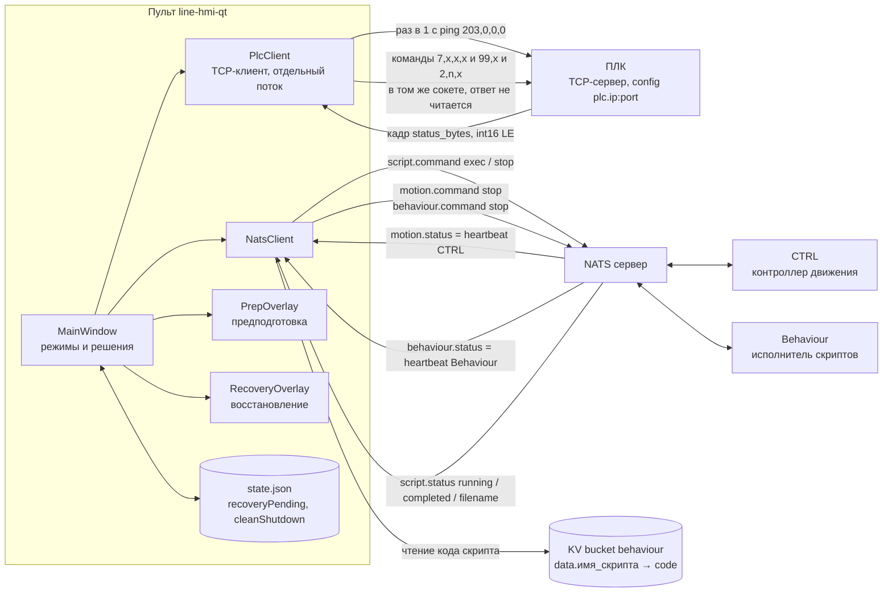
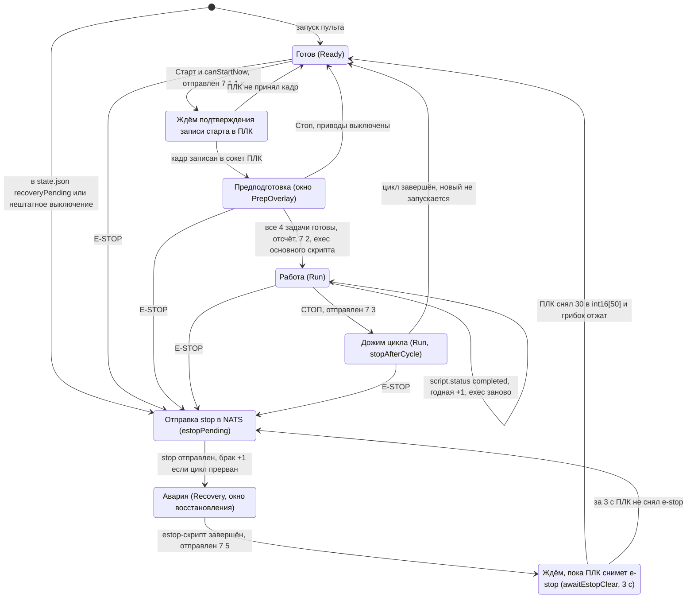
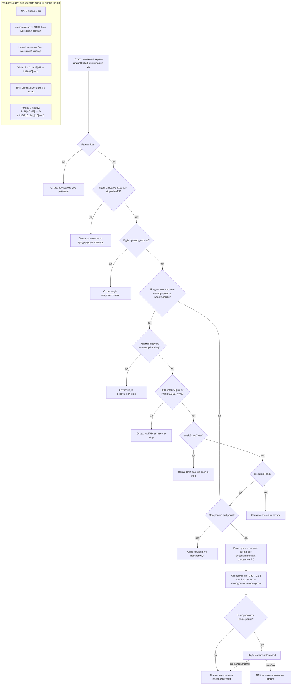
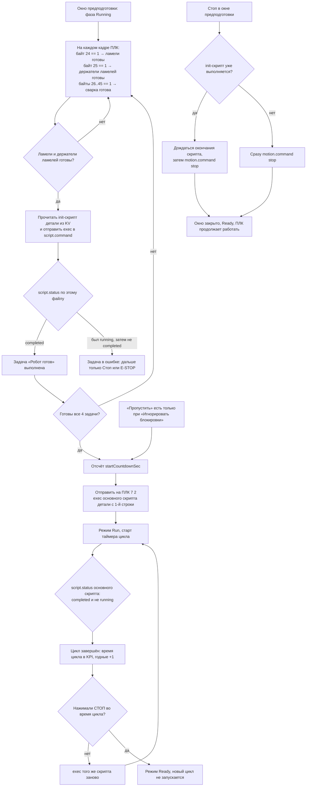
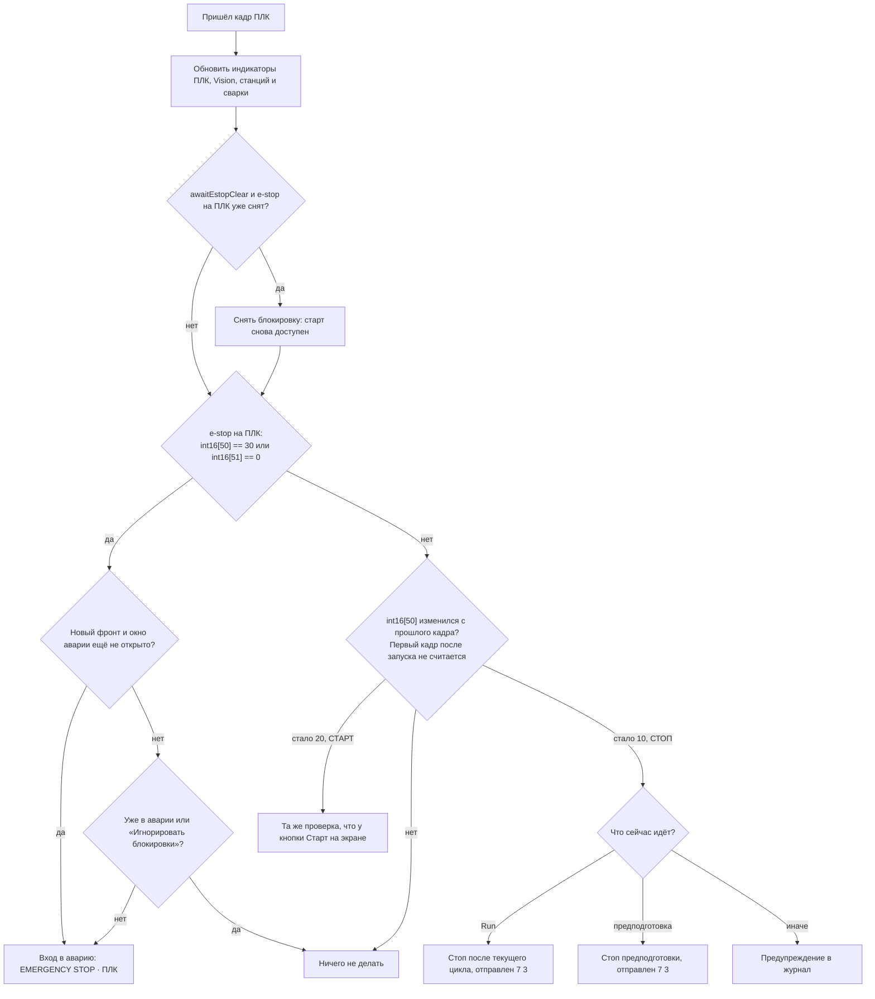
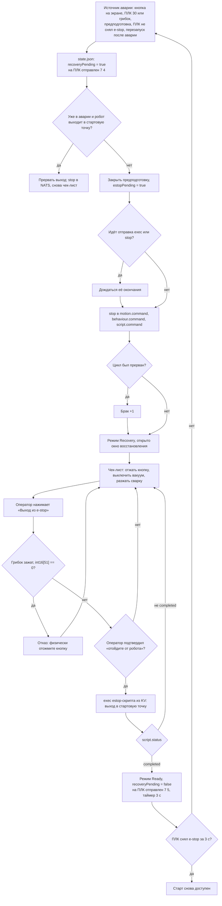

# Логика пульта line-hmi-qt: ПЛК, робот, режимы

Схема собрана по коду: `src/MainWindow.cpp`, `src/PlcClient.*`, `src/NatsClient.cpp`,
`src/PrepOverlay.cpp`, `src/RecoveryOverlay.cpp`, `src/RuntimeState.cpp`.

В коде три режима: «Готов» (Ready), «Работа» (Run) и «Авария» (Recovery). Решения принимаются
по кадру состояния, который пульт раз в секунду запрашивает у ПЛК, по heartbeat модулей робота
в NATS и по статусу выполнения скрипта.

## 1. Кто с кем и как общается

### Команды на ПЛК (4 байта `[7, code, a, b]`)

| Кадр | Когда отправляется | Смысл |
|---|---|---|
| `7 1 1 0` / `7 1 2 0` | нажата кнопка «Деталь 1» / «Деталь 2» | выбор программы |
| `7 1 1 1` (`7 1 1 0`, если тензодатчик игнорируется) | Старт (кнопка на экране или зелёная на корпусе) | старт предподготовки |
| `7 2 0 0` | предподготовка закончилась, запускается основная программа | основная программа пошла |
| `7 3 0 0` | Стоп в работе; кнопка СТОП на корпусе во время предподготовки | стоп |
| `7 4 0 0` | любой вход в аварию | аварийный стоп |
| `7 5 0 0` | выход из аварии (после восстановления, через «Старт без восстановления» или сброс в админке) | выход из e-stop |
| `99 1` / `99 0` | сервисная панель | сервисный режим вкл/выкл |
| `2 n 1` / `2 n 0` | сервисная панель | дискретный выход n вкл/выкл |

`commandFinished(ok)` означает только то, что кадр записан в сокет. Ответ ПЛК на команду не читается.

### Команды в NATS

| Subject | Payload | Когда |
|---|---|---|
| `script.command` | `{command:"exec", type:"Script", code, from_line, filename}` | запуск init-скрипта, основного скрипта, estop-скрипта |
| `motion.command`, `behaviour.command`, `script.command` | `{command:"stop"}` во все три | аварийный стоп, прерывание выхода из аварии |
| `motion.command` | `{command:"stop"}` | Стоп в окне предподготовки (выключить приводы) |
| `motion.command` | `start` / `stop` / `moveOffset` | админка, ручное управление |

Код скрипта берётся из KV bucket `behaviour` по ключу `data.<имя файла>`. Имена файлов
(init/основной для каждой детали, estop-скрипт) задаются в админке.

### Что пульт читает из кадра ПЛК

| Ячейка | Условие | Значение |
|---|---|---|
| сам факт ответа | кадр пришёл не позже 3 с назад | «ПЛК · OK» |
| int16[10..14], [16] | все == 1 | сварка готова |
| int16[40], [41], [42] | все == 0 | станции ламелей, малых и больших держателей ламелей готовы |
| int16[45] / [46] | == 1 | Vision 1 / Vision 2 работают |
| int16[50] | 10 / 20 / 30 | защёлка ПЛК: кнопка СТОП / СТАРТ на корпусе / e-stop |
| int16[51] | == 0 | грибок e-stop зажат |
| int16[52..59] | == 1 | «Замечания» на левой панели во время работы |
| байт 24 / байт 25 / байты 26..45 | все == 1 | задачи предподготовки: ламели / держатели ламелей / сварка |

## 2. Режимы пульта

E-STOP означает любой источник аварии: кнопку на экране, значение 30 в int16[50] или зажатый
грибок (int16[51] = 0), кнопку «Экстренная остановка» в окне предподготовки или ПЛК, который
не снял e-stop за 3 с после `7 5`.

## 3. Как принимается решение «можно стартовать»

Те же условия построчно показаны в левом чек-листе («Инициализация» / «Перед запуском»)
и в индикаторах в шапке.

## 4. Предподготовка и основной цикл

## 5. Обработка кадра ПЛК (раз в секунду)

## 6. Авария и восстановление

Раз в секунду пульт записывает в `state.json` флаг `cleanShutdown` («Можно выключать питание ·
ДА/НЕТ»). Он равен ДА, когда нет работы, предподготовки, отправки команды и выхода робота
в стартовую точку. Если питание сняли при НЕТ или в аварии, после перезапуска пульт сразу
открывает окно аварии.

## Что стоит проверить

1. **Кадр старта не зависит от выбранной детали.** `PlcClient::startCommand` всегда шлёт
   `7 1 1 x`, даже для «Детали 2». Если тензодатчик игнорируется, кадр старта `7 1 1 0`
   по байтам совпадает с кадром «выбрать Деталь 1» — ПЛК не может отличить одно от другого.

2. **Байты предподготовки пересекаются с ячейками сварки.** Предподготовка читает байты 24, 25
   и 26..45 — это те же байты, что int16[12..22]. Готовность сварки при этом требует
   int16[10..14] и [16] == 1, то есть байт 24 = 1, байт 25 = 0, байт 27 = 0. При готовой
   сварке «ламели» засчитываются сразу, а «держатели ламелей» и «сварка» не засчитаются, пока ПЛК
   не поменяет эти int16. В `PlcClient.h` смещения помечены как временные.

3. **Стоп в окне предподготовки не отправляет `7 3`.** Его отправляет только кнопка СТОП
   на корпусе. Экранная кнопка лишь выключает приводы робота через NATS, ПЛК продолжает работать.
